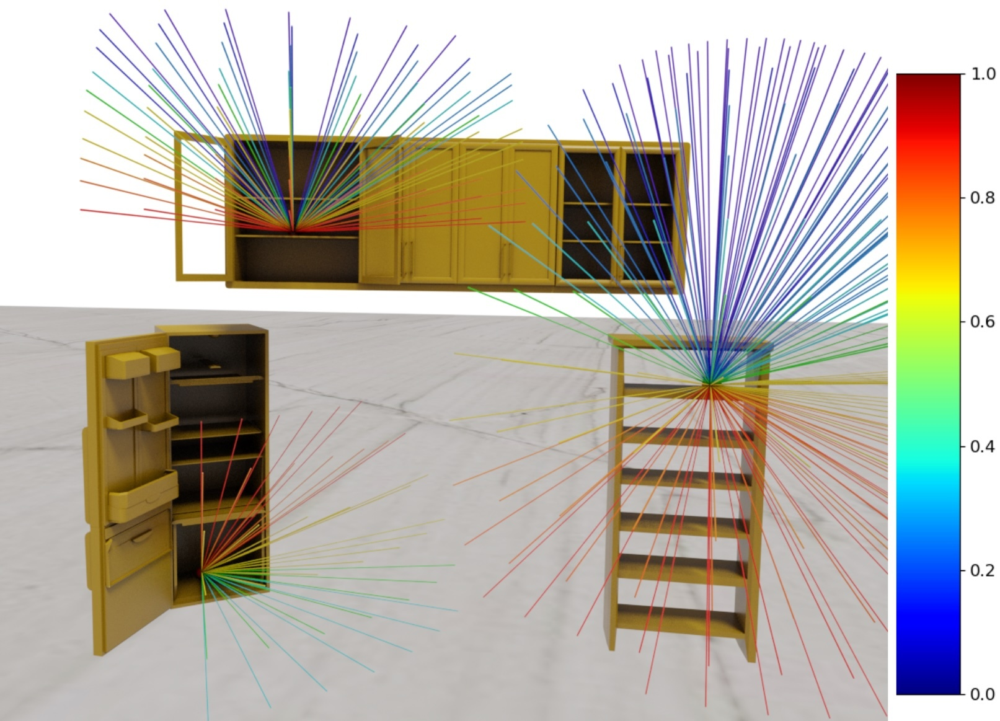

# ReachingField

This repository is the official implementation of ReachingField model from 
our __3DV 2025__ paper:

**3D Whole-body Grasp Synthesis with Directional Controllability**
(https://gpaschalidis.github.io/cwgrasp/).

<a href="">

</a>

ReachingField is a probabilistic 3D vector field conditioned on a 3D object. 
Specifically, it defines a distribution over the directions
from which a body's arm and hand can reach an object, without penetrating 
obstacles around the object. Below, we provide visualizations illustrating how
ReachingField is formed for objects placed at various heights, ranging from low to high, 
on different receptacle objects.

<p align="center">
    
    
    
    
</p>


## Installation & Dependencies
Clone the repository using:

```bash
git clone git@github.com:gpaschalidis/reachingfield.git
cd reachingfield
```
Run the following commands:
```bash
conda create -n reachingfield python=3.9 -y
conda activate reachingfield
conda install pytorch==2.0.1 torchvision==0.15.2 torchaudio==2.0.2 pytorch-cuda=11.7 -c pytorch -c nvidia
pip install "git+https://github.com/facebookresearch/pytorch3d.git@stable"
pip install -r requirements.txt
 ```

## Installing Dataset
To try ReachingField you can use any data you want. However, for our paper we use 
the grasping objects from GRAB dataset and the ReplicaGrasp dataset.

- Download first the GRAB object mesh (`.ply`) files from the [GRAB website](https://grab.is.tue.mpg.de/).
- Download the ReplicaGrasp dataset from [FLEX github page](https://github.com/purvaten/FLEX)
- Create a data folder and paste inside the above datasets, so that they have the following 
structure:

```bash
    reachingfield
    ├── data
    │   │
    │   ├── inter_obj
    │   │    └── contact_meshes
    │   │             ├── airplane.ply
    │   │             └── ...
    │   │
    │   └── replicagrasp
    │        ├── dset_info.npz
    │        └── receptacles.npz
    .
    .
```
 

## Testing ReachingField
To try ReachingField and generate visualizations for each of its building steps, use the following command:

```bash
python test_reachingfield.py cup_receptacle_aabb_WC1_Top3frl_apartment_wall_cabinet_01_all_1 --grasp_type "right" --vis

```
Instead of cup_receptacle_aabb_WC1_Top3frl_apartment_wall_cabinet_01_all_1 you can use any key of the dictionary 
inside the dset_info.npz file.


## Citation
If you found this work influential or helpful for your research, please cite:
```
@InProceedings{paschalidis20243d,
  title     = {3D Whole-body Grasp Synthesis with Directional Controllability},
  author    = {Paschalidis, Georgios and Wilschut, Romana and Anti{\'c}, Dimitrije and Taheri, Omid and Tzionas, Dimitrios},
  booktitle = {International Conference on 3D Vision (3DV)},
  year      = {2025}
 }
```
